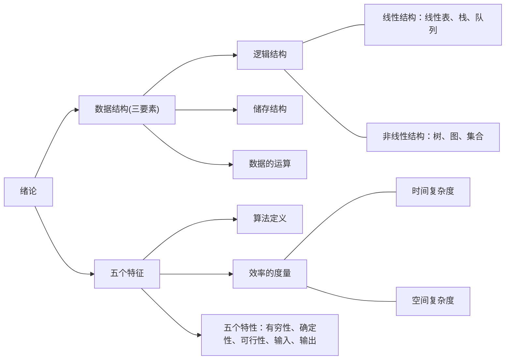

# 绪论

```mermaid
graph LR
A["绪论"] --> B["数据结构(三要素)"]
A --> C["五个特征"]
B-->D["逻辑结构"]
B-->E["储存结构"]
B-->F["数据的运算"]
D---G["线性结构：线性表、栈、队列"]
D---H["非线性结构：树、图、集合"]
C-->I["算法定义"]
C-->J["效率的度量"]
C-->K["五个特性：有穷性、确定性、可行性、输入、输出"]
J---L["时间复杂度"]
J---M["空间复杂度"]
```

